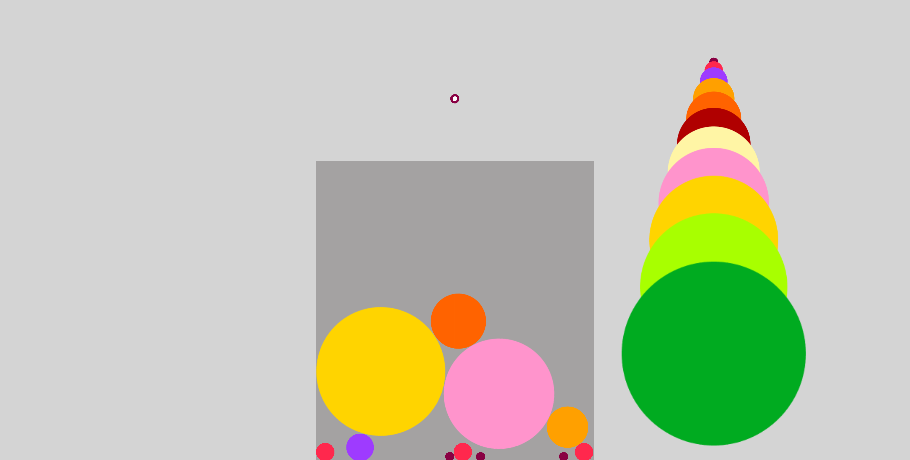
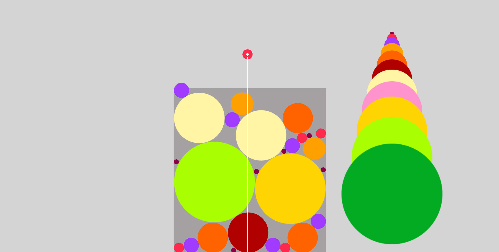

# Dev Log

## Milestones

- [X] Define classes and functions
- [X] Move cursor left and right
- [X] Drop circles under cursor
- [X] Random circles of different sizes appear at the cursor after previous circle dropped
- [X] Circles fall and roll around in a box
- [X] Tiny circles merge into larger circle when they collide.
- [ ] Scoring system
- [ ] Detect when circles overflow out of box and terminate game.
- [ ] Detect when shapes merge into a watermelon!
- [ ] Graphic/UI design: Display score, next shape, text

## 2024-08-26

Points per fruit: it doesn't seem like it's listed anywhere on the points per fruit for the Nintendo Switch version of the Suika game but here are my "notes" watching a streamer.

Before anything else, it's worth highlighting that you don't get points for dropping fruit into the box. You only get points with merging fruit.
 
 - Cherry => Strawberries: 1-2 pts
 - Strawberries => Grape: 2-3 pts 
 - Grapes => Dekopon: 6-7 pts
 - Dekopons => Orange: 10 pts
 - Oranges => Apple: 15 pts
 - Apples => Pear: 21 pts
 - Pears => Peach: 28 pts
 - Peaches => Pineapple: 36 pts
 - Pineappes => Melon: 45 pts
 - Melons => Suika! 55 pts

 Seems like the smaller fruits have randomized points. I'll assume the larger points for now.

## 2024-08-24

Hello world!

This is a silly idea I've had for a while now ever since the Suika game took off among the video game streamers. I figured that the mechanics of the game could be simple enough to program, especially with an existing game engine like Unity.

So a little over 12 hours after my initial commit and I have a decent "working game" in Unity! Most importantly the same fruit shapes automatically merge into the larger fruits.

Pretty much just need to add a scoring system and test how the game detects the player actually getting a watermelon (or fail by having circles overflow). See milestone TODOS above.

I am most anxious to tweak the size/proportions of the different fruits and the box itself. That will take some playtesting.